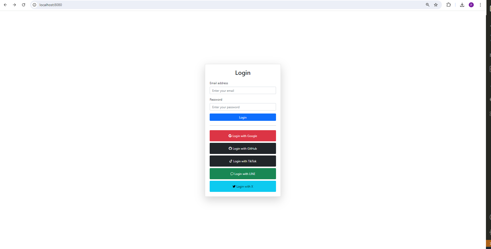

### Set **.env** file
### How to link get key and secret
 - [Google](https://developers.google.com/identity/protocols/oauth2)
 - [Github](https://docs.github.com/en/apps/oauth-apps/building-oauth-apps/authorizing-oauth-apps)
 - [X](https://developer.x.com/en/docs/platform-overview)
 - [Tiktok](https://developers.tiktok.com/doc/overview/)
 - [Line](https://developers.line.biz/en/docs/line-login/integrate-line-login/)
### Run in terminal
```bash 
go run main.go
```
### Open http://localhost:8080
### Example UI
